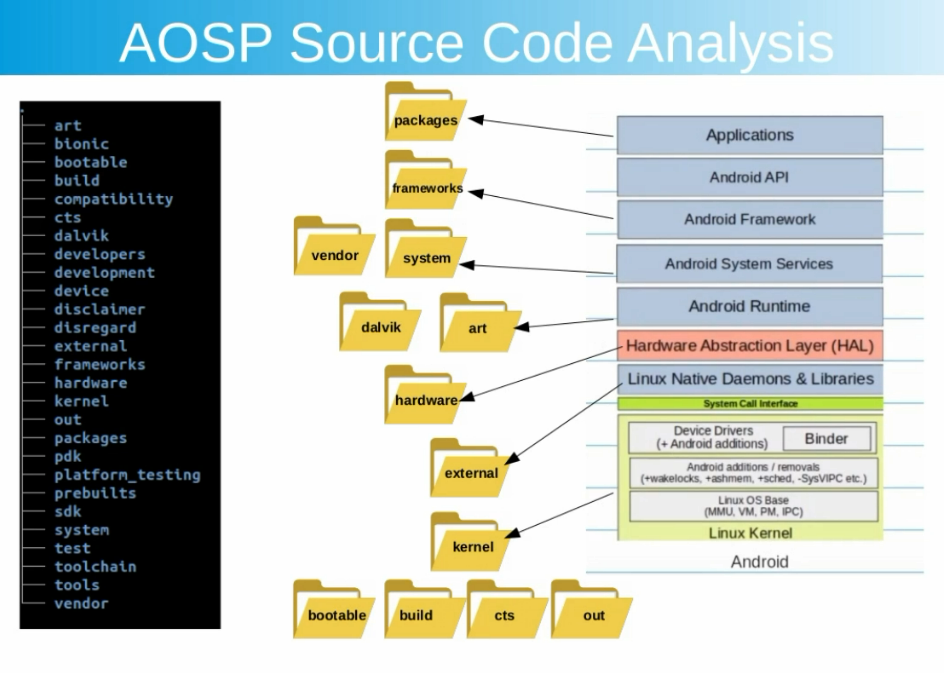
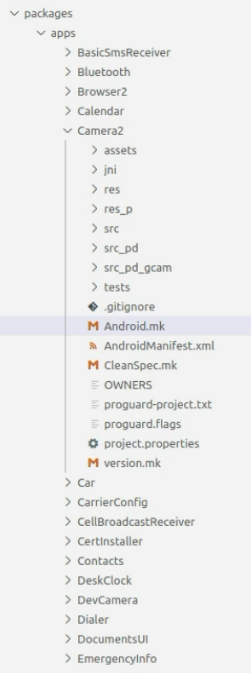
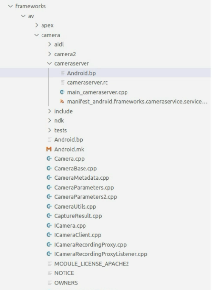

# 1.2 AOSP Source

## AOSP Source Code - Folder Structure

### **packages/**

The `packages/` directory contains the source code for default Android applications, including Contacts, Calendar, and other system apps.

#### Key Points:
- This folder houses pre-installed applications in AOSP.
- To integrate a custom application into AOSP, you need to:
  - Add Java application files.
  - Include a build configuration file such as `Android.mk` or `Android.bp` (Soong Build System).

By properly setting up and modifying this directory, developers can seamlessly add new applications to the Android source code.

### **frameworks/**

The `frameworks/` directory is implementation of key services such as System Server, Activity Managers, having the combination of Java and C/C++ native libraries where interaction between sources will happen, such as mapping between the java application APIs and the native C++ libraries.

#### Key Points:
- Provides the core Android services and APIs.
- Bridges the gap between Java-based application layers and native system components.
- Contains crucial system components such as:
  - `base/` - Core framework classes and APIs.
  - `native/` - Native C++ libraries used by system services.
  - `av/` - Media framework implementation.
  - `opt/` - Optional components and experimental features.

### **system/**

The `system/` directory is the minimal Linux system that is started before the Dalvik VM and any java based services are enabled.
This includes the source code for the init process and the default init.rc script that provide the dynamic configuration of the platform.

#### Key Points:
- Contains essential system components required for booting Android.
- Includes the `init` process, which is responsible for initializing system services.
- Provides `init.rc`, which defines system properties and startup configurations.
- Bridges the Linux kernel with Android's higher-level services.

### **vendor/**

The `vendor/` directory is vendor-specific and contains custom apps, SE policies, hardware configurations, and so on.
This folder is not part of the AOSP source. We'll add our custom Service, HAL code to modify AOSP.

### **vendor/**

The `vendor/` directory is vendor-specific and contains custom apps, SE policies, hardware configurations, and so on.
This folder is not part of the AOSP source. We'll add our custom Service, HAL code to modify AOSP.

### **davik/**

The `davik/` directory is Dalvik VM which has been replaced by the Android Runtime (ART) since Android 5.0

### **art/**

The `art/` Implementation of Android Runtime layer,
including Ahead-Of-Time (AOT) compilation, Just-In-Time (JIT) compilation to run the .dex file which created by Java.

### **hardware/**

The `hardware/` directory contains the Android Hardware Abstraction Layer (HAL) specification and implementation.

#### Key Points:
- Defines interfaces for hardware components such as cameras, sensors, and audio.
- Enables communication between the Android framework and device hardware.
- Contains vendor-specific hardware implementations for different chipsets.

### **bootable/**

The `bootable/` is the second Bootloader, and some tools for recovery, flashing such as fastboot.

#### Key Points:
- Responsible for booting the Android system after the primary bootloader.
- Includes recovery mode implementations.
- Provides fastboot tools for flashing firmware and system images.

### **cts/**

The `cts/` is the Compatibility Test suite to ensure that a build complies with the Android specification.

### **build/**

The `build/` contains Scripts, Configurations for Build process, coordinating the compilation, linking, and packaging of various components. Some Android Build Systems such as mk, soong.

### **out/**

The out/` directory is the build output directory where all compiled binaries, system images, and intermediate build files are stored.

#### Key Points:

- Contains generated files after running the build system (make or m).

- Stores system images (system.img, boot.img, etc.) used for flashing onto devices.

- Includes temporary build artifacts that can be cleaned using make clean or make clobber.

This directory is crucial for debugging and testing AOSP builds, as it holds all the necessary outputs from the compilation process.