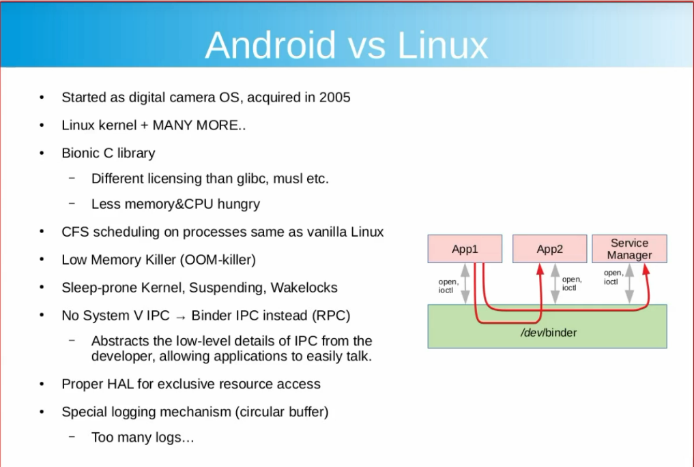
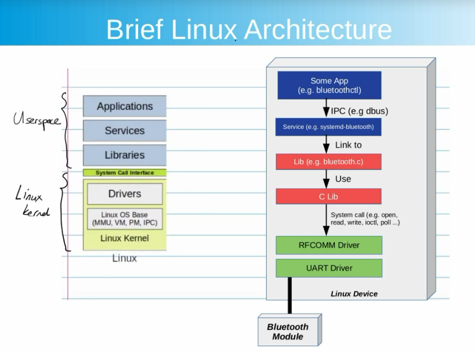
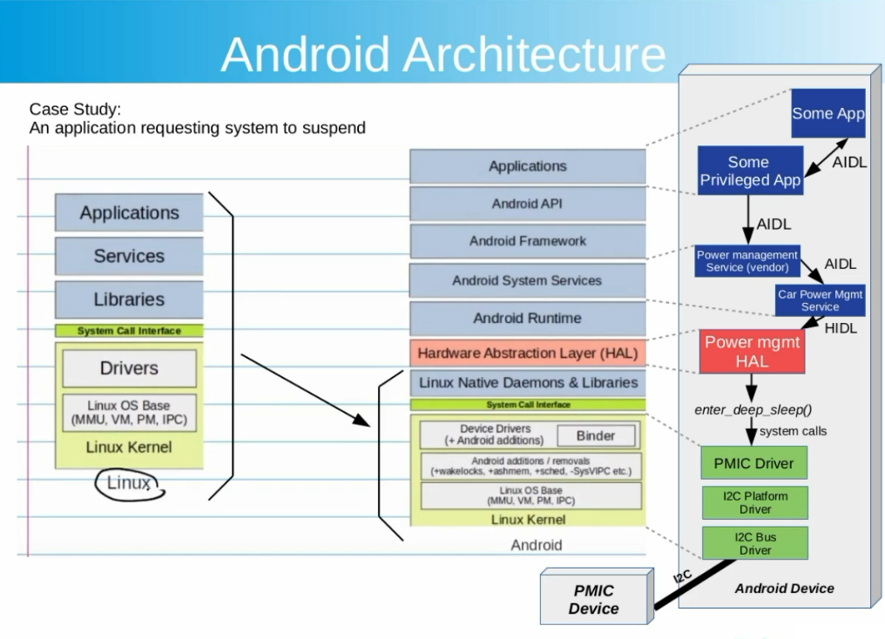
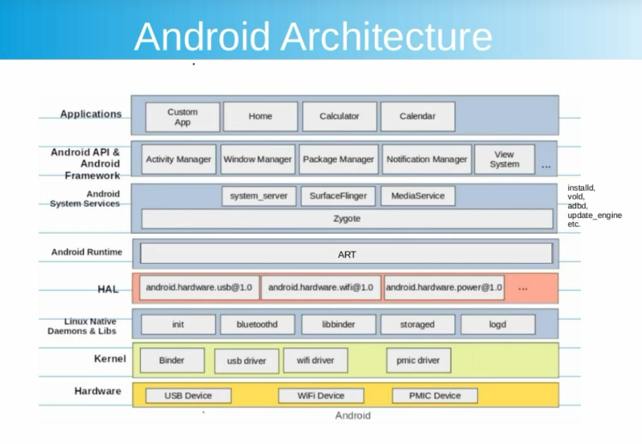

# 01. Android Architecture

## Android vs Linux

### Why using CFS?
The Completely Fair Scheduler (CFS) is the default scheduler for the Linux kernel, designed to provide efficient, fair, and predictable scheduling for processes. Here are the key reasons for using CFS:

- Fairness:

CFS ensures that CPU time is distributed as fairly as possible among processes.
Each process gets a share of CPU proportional to its weight (based on priority or nice values).

- Scalability:

CFS can handle a large number of processes efficiently due to its logarithmic complexity (O(log n)).
Uses a red-black tree data structure to keep track of runnable processes, ensuring efficient insertion and selection.

- Low Latency:

Provides low scheduling latency, ensuring responsive behavior for interactive applications.
Implements preemption to prevent long-running tasks from starving shorter tasks.

- Proportional Scheduling:

Allocates CPU time based on task priorities, allowing tasks with higher priority to get more CPU time.
The "niceness" of tasks influences their scheduling weight.

- Simplicity and Determinism:

Designed to mimic an "ideal multitasking CPU," where every runnable task executes simultaneously at a slow pace.
This approach makes it easier to predict CPU allocation and performance.

- Compatibility:

Well-suited for diverse workloads, including desktops, servers, and real-time systems (with specific configurations).

- Fair Handling of Sleepers:

Provides fairness even to tasks that frequently sleep or wait for I/O, preventing starvation.

CFS is particularly useful for general-purpose computing environments where fairness and responsiveness are important.

### System V IPC vs. Binder IPC

#### **System V IPC**
System V IPC is a traditional interprocess communication mechanism used in Unix-based systems, providing methods like message queues, shared memory, and semaphores.

- **Features**:
  - *Message Queues*: Allow processes to exchange messages in a FIFO manner.
  - *Shared Memory*: Provides a shared region of memory accessible by multiple processes.
  - *Semaphores*: Used for synchronization between processes.
- **Advantages**:
  - Simple and reliable for basic IPC.
  - Widely supported in Unix-like systems.
- **Disadvantages**:
  - Lacks fine-grained security controls.
  - Resource leaks can occur if IPC objects are not properly cleaned up.
  - Not optimized for modern, high-performance systems.

---

#### **Binder IPC**
Binder IPC is a high-performance IPC mechanism developed specifically for the Android ecosystem to facilitate secure communication between applications and system services.

- **Features**:
  - Transaction-based communication using client-server architecture.
  - Supports synchronous calls, object reference management, and dead object notifications.
  - Fine-grained security with per-process permissions.
- **Advantages**:
  - Optimized for Android with low overhead and high performance.
  - Built-in security model simplifies access control.
  - Abstracts low-level communication details for developers.
- **Disadvantages**:
  - Tightly coupled with Android systems.
  - More complex to use in non-Android environments.

---

#### **Comparison Table**

| Feature                     | System V IPC               | Binder IPC                |
|-----------------------------|----------------------------|---------------------------|
| **Introduced By**           | Unix (System V)            | Android                   |
| **Mechanisms**              | Message queues, semaphores, shared memory | Transaction-based IPC    |
| **Security**                | Limited                    | Fine-grained (per-process permissions) |
| **Overhead**                | Higher                     | Lower                     |
| **Performance**             | Moderate                  | Optimized for Android     |
| **Suitability**             | General-purpose systems    | Android-specific systems  |
| **Ease of Use**             | Simpler APIs               | More complex for standalone systems |

---

#### **Conclusion**
- **System V IPC** is ideal for general-purpose Unix applications needing basic and straightforward interprocess communication.
- **Binder IPC** is tailored for Android, offering secure, efficient, and robust communication for modern applications.

## Linux Architecture Basic

## Android Architecture

### CDD Requirements?
- Comply to CDD (Compatible Definition Docs) issued by Google to pass the CTS test.
### SELinux neverallowed
- In SELinux, the neverallow rule is a policy construct that explicitly denies a specific set of permissions or access for certain domains or types. It is used by SELinux policy developers to enforce strong constraints and ensure that no policy ever grants the specified permissions. This rule is a powerful tool to prevent misconfigurations and potential security vulnerabilities.

### Zygote is the root System Service in Android. It will spawn services and apps consequently:
- system_server -> other system services
- All applications